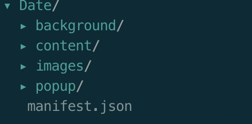
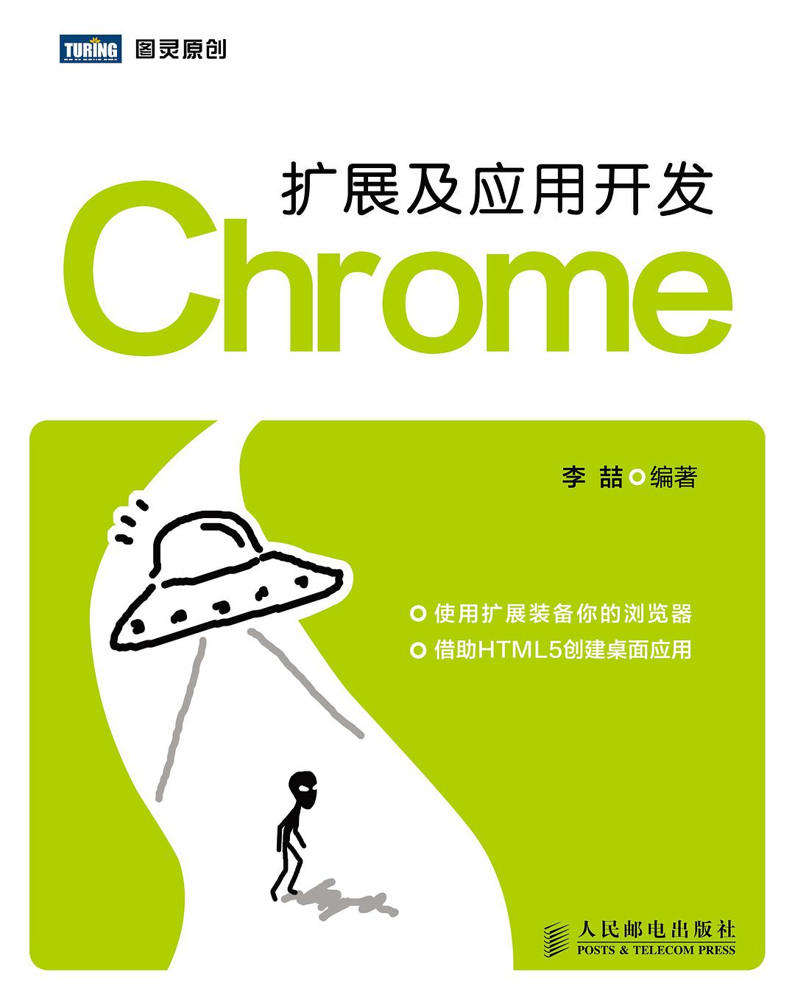

title: Chrome Extension
speaker: 袁干平

<slide class="bg-black-blue aligncenter" image="images/chrome.png">

## **Chrome Extension** {.text-landing.text-shadow.blue}

:::column {.ms}

---

分享人：袁干平 {.alignright}

::: {.text-intro}

<slide class="bg-white">

## 大纲 {.text-landing.aligncenter}

---

:::column

---

1. :常用的插件和扩展:{.alignleft}
2. :Chrome 插件、扩展的开发:{.alignleft}
3. :Chrome 插件开发畅想:{.alignleft}
   {.build.moveIn}

---

:::

<slide class="bg-white">

## 常用插件 {.text-landing.aligncenter}

---

::: column

---

1. :OneTab:{.alignleft}
2. :Octotree:{.alignleft}
3. :FeHelper(前端助手):{.alignleft}
4. :GITHUBER - New Tab:{.alignleft}
5. :Proxy SwitchyOmega:{.alignleft}
6. :Tampermonkey:{.alignleft}
   {.build.moveIn}

---

<slide class="bg-white">

## WHAT

---

<p>
谷歌扩展（chrome extension），在认识之前，首先要明确一个观念，这种扩展程序，实际上不是一个exe、app之类的程序，下载了本地打开运行安装，本质上，它就是一个网页，写的用的都是前端的语言，高档点说是一个程序，通俗来讲， 就是运行在浏览器上的一个网站，网页。
</p>

<slide class="bg-white aligncenter">

## Chrome 插件基本组成 {.text-landing.aligncenter}

---

::: column

---

1. :manifest.json:{.alignleft}
2. :background script:{.alignleft}
3. :content script:{.alignleft}
4. :popup:{.alignleft}
   {.build.moveIn}

---

<slide class="bg-white">

## 开发插件 {.text-landing.aligncenter}

---

1. :目录结构:{.alignleft}



2. :入口文件 manifest.json:{.alignleft}

```javascript
 {
  "manifest_version": 2,
  "name": "我的Chrome插件",
  "version": "1.0.0",
  "icons": {
    "16": "images/icon16.png",
    "48": "images/icon48.png"
  },
  "browser_action": {
    "default_title": "你来点我呀",
    "default_popup": "popup/popup.html",
    "default_icon": "images/icon32.png"
  },
  "background": {
    "page": "background/background.html"
  },
  "permissions": ["contextMenus","storage", "http://*/*", "https://*/*"],
  "content_scripts":
    [
      {
          "matches": ["<all_urls>"],
          "js": ["content/index.js"]
      }
    ]
}

```

<slide class="bg-white aligncenter">

## 基础的通信机制 {.text-landing.aligncenter}

---

::: column

---

1. :content 与 background 的通信:{.alignleft}
2. :popup 与 background 的通信:{.alignleft}
3. :popup 与 content 的通信:{.alignleft}
   {.build.moveIn}

---

<slide class="bg-white aligncenter">

## 应用场景畅想

---

::: column

---

1. :vpn 的代理:{.alignleft}
2. :bug 监测系统:{.alignleft}
3. :页面主题修改系统:{.alignleft}

---

<slide class="bg-white aligncenter">

## 书籍推荐

---



<slide class="bg-white aligncenter">

## Q&A {.text-landing}

---

<slide class="bg-white aligncenter">

## 谢谢大家 {.text-landing}

---
